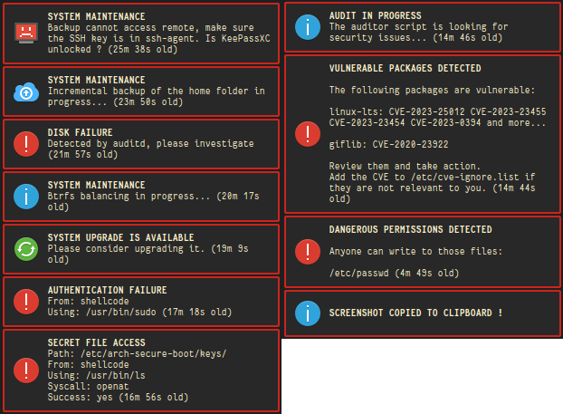

# ArchLinux Hardened

This repository contains my ArchLinux setup which focuses on desktop security.

Beside security, my setup also aims to use all the bleeding edge and state of the art software we currently have available, most notably:

- Btrfs : [copy-on-write](https://en.wikipedia.org/wiki/Copy-on-write) filesystem with snapshot support
- Wayland : because X11 is old, slow, and insecure
- NFTables : because firewalling with iptables syntax sucks

Because of its hardened nature, you might have to get your hands dirty to get things to work.
Therefore this setup is not recommended if you don't have good GNU/Linux knowledge already.

## Highlights

Physical tampering hardening:

- Secure boot without Microsoft's keys
- No GRUB-like bootloader, the kernel is booted into directly thanks to [unified kernel images](https://wiki.archlinux.org/title/Unified_kernel_image)
- Full disk encryption using LUKS 2

Exploit mitigation:

- GrapheneOS' hardened kernel
- Kernel's lockdown mode set to "integrity"
- Firejail + AppArmor (see [FIREJAIL.md](docs/FIREJAIL.md) for the why)

Network hardening:

- Strict firewalling rules (drop everything by default, see [NETWORKING.md](https://github.com/ShellCode33/ArchLinux-Hardened/blob/master/docs/NETWORKING.md))
- Reverse Path Filtering set to strict
- ICMP redirects disabled
- The hardened kernel has very strong defaults regarding network security

System monitoring:

- Auditd reporting through desktop notifications
- Many systemd services helping you to manage your system to keep it secure
- Firewall denials notifications

System resilience:

- LTS kernel fallback from the BIOS to fix a broken system
- Automated encrypted backups uploaded to a remote server (manual configuration required)
- Automated encrypted incremental backups to an external USB drive (manual configuration required)

This setup uses desktop notifications extensively, I think this is a good way of monitoring your PC.

I want to know what's going on at all times, if something fails I want to be aware of it as soon as possible in order to fix it.

Here's a sample of notifications you might get:

## Installation

Head over to [INSTALL.md](docs/INSTALL.md)

## Additional documentation

- [My threat model](/docs/THREAT_MODEL.md)
- [Manage SSH and GPG secrets securely without a password thanks to KeePassXC](docs/HOW_TO_MANAGE_SECRETS.md)
- [Setup an auto-mounted encrypted standalone USB device](docs/HOW_TO_SECURE_USB_DEVICE.md)
- [Firefox hardening tips](docs/HOW_TO_FIREFOX.md)
- [FAQ and troubleshooting](docs/FAQ_AND_TROUBLESHOOTING.md)
